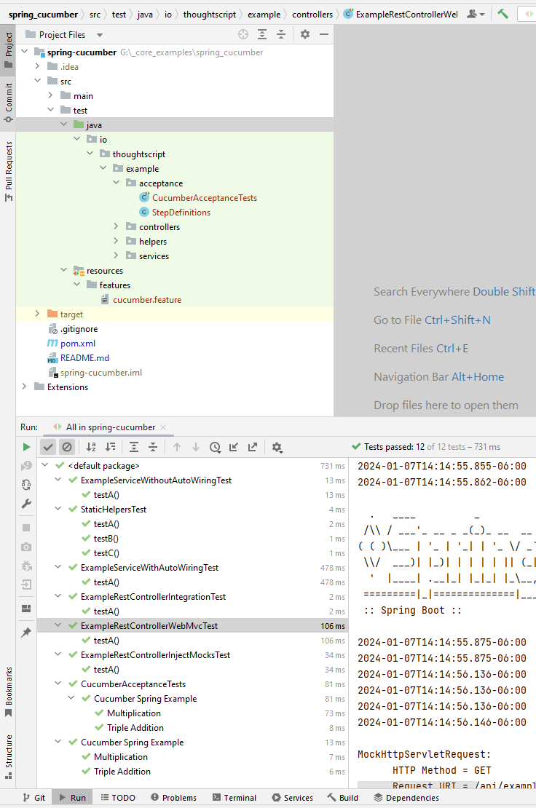

# spring_cucumber

[](https://jdk.java.net/archive/)
[](https://spring.io/projects/spring-boot)
[](https://maven.apache.org/download.cgi)

Experiments with Spring, Cucumber, and revisiting JUnit 5.

## Objectives

1. Should run all supplied kinds of test under command `mvn clean install`.
2. Should run all supplied kinds of test when right-clicking and selecting the "run test" option in IntelliJ (on the `/test` classpath).
3. Should run all supplied kinds of tests with `maven-sure-fire` under command `mvn spring-boot:run`.

## Install

Maven, Jupiter, Cucumber, etc.

## Use

```BASH
mvn clean
mvn install
mvn spring-boot:run
```

## Correct Outputs

```bash
"C:\Program Files\Java\jdk-18.0.2.1\bin\java.exe" -ea -Didea.test.cyclic.buffer.size=1048576 "-javaagent:C:\Program Files\JetBrains\IntelliJ IDEA Community Edition 2022.2.2\lib\idea_rt.jar=51308:C:\Program Files\JetBrains\IntelliJ IDEA Community Edition 2022.2.2\bin" -Dfile.encoding=UTF-8 -Dsun.stdout.encoding=UTF-8 -Dsun.stderr.encoding=UTF-8 -classpath "C:\Program Files\JetBrains\IntelliJ IDEA Community Edition 2022.2.2\lib\idea_rt.jar;C:\Program Files\JetBrains\IntelliJ IDEA Community Edition 2022.2.2\plugins\junit\lib\junit5-rt.jar;C:\Program Files\JetBrains\IntelliJ IDEA Community Edition 2022.2.2\plugins\junit\lib\junit-rt.jar;G:\_core_examples\spring_cucumber\target\test-classes;G:\_core_examples\spring_cucumber\target\classes;C:\Users\adami\.m2\repository\org\springframework\boot\spring-boot-starter-web\3.2.1\spring-boot-starter-web-3.2.1.jar;C:\Users\adami\.m2\repository\org\springframework\boot\spring-boot-starter\3.2.1\spring-boot-starter-3.2.1.jar;C:\Users\adami\.m2\repository\org\springframework\boot\spring-boot\3.2.1\spring-boot-3.2.1.jar;C:\Users\adami\.m2\repository\org\springframework\boot\spring-boot-autoconfigure\3.2.1\spring-boot-autoconfigure-3.2.1.jar;C:\Users\adami\.m2\repository\org\springframework\boot\spring-boot-starter-logging\3.2.1\spring-boot-starter-logging-3.2.1.jar;C:\Users\adami\.m2\repository\ch\qos\logback\logback-classic\1.4.14\logback-classic-1.4.14.jar;C:\Users\adami\.m2\repository\ch\qos\logback\logback-core\1.4.14\logback-core-1.4.14.jar;C:\Users\adami\.m2\repository\org\apache\logging\log4j\log4j-to-slf4j\2.21.1\log4j-to-slf4j-2.21.1.jar;C:\Users\adami\.m2\repository\org\apache\logging\log4j\log4j-api\2.21.1\log4j-api-2.21.1.jar;C:\Users\adami\.m2\repository\org\slf4j\jul-to-slf4j\2.0.9\jul-to-slf4j-2.0.9.jar;C:\Users\adami\.m2\repository\jakarta\annotation\jakarta.annotation-api\2.1.1\jakarta.annotation-api-2.1.1.jar;C:\Users\adami\.m2\repository\org\yaml\snakeyaml\2.2\snakeyaml-2.2.jar;C:\Users\adami\.m2\repository\org\springframework\boot\spring-boot-starter-json\3.2.1\spring-boot-starter-json-3.2.1.jar;C:\Users\adami\.m2\repository\com\fasterxml\jackson\core\jackson-databind\2.15.3\jackson-databind-2.15.3.jar;C:\Users\adami\.m2\repository\com\fasterxml\jackson\core\jackson-annotations\2.15.3\jackson-annotations-2.15.3.jar;C:\Users\adami\.m2\repository\com\fasterxml\jackson\core\jackson-core\2.15.3\jackson-core-2.15.3.jar;C:\Users\adami\.m2\repository\com\fasterxml\jackson\datatype\jackson-datatype-jdk8\2.15.3\jackson-datatype-jdk8-2.15.3.jar;C:\Users\adami\.m2\repository\com\fasterxml\jackson\datatype\jackson-datatype-jsr310\2.15.3\jackson-datatype-jsr310-2.15.3.jar;C:\Users\adami\.m2\repository\com\fasterxml\jackson\module\jackson-module-parameter-names\2.15.3\jackson-module-parameter-names-2.15.3.jar;C:\Users\adami\.m2\repository\org\springframework\boot\spring-boot-starter-tomcat\3.2.1\spring-boot-starter-tomcat-3.2.1.jar;C:\Users\adami\.m2\repository\org\apache\tomcat\embed\tomcat-embed-core\10.1.17\tomcat-embed-core-10.1.17.jar;C:\Users\adami\.m2\repository\org\apache\tomcat\embed\tomcat-embed-el\10.1.17\tomcat-embed-el-10.1.17.jar;C:\Users\adami\.m2\repository\org\apache\tomcat\embed\tomcat-embed-websocket\10.1.17\tomcat-embed-websocket-10.1.17.jar;C:\Users\adami\.m2\repository\org\springframework\spring-web\6.1.2\spring-web-6.1.2.jar;C:\Users\adami\.m2\repository\org\springframework\spring-beans\6.1.2\spring-beans-6.1.2.jar;C:\Users\adami\.m2\repository\io\micrometer\micrometer-observation\1.12.1\micrometer-observation-1.12.1.jar;C:\Users\adami\.m2\repository\io\micrometer\micrometer-commons\1.12.1\micrometer-commons-1.12.1.jar;C:\Users\adami\.m2\repository\org\springframework\spring-webmvc\6.1.2\spring-webmvc-6.1.2.jar;C:\Users\adami\.m2\repository\org\springframework\spring-aop\6.1.2\spring-aop-6.1.2.jar;C:\Users\adami\.m2\repository\org\springframework\spring-context\6.1.2\spring-context-6.1.2.jar;C:\Users\adami\.m2\repository\org\springframework\spring-expression\6.1.2\spring-expression-6.1.2.jar;C:\Users\adami\.m2\repository\org\projectlombok\lombok\1.18.30\lombok-1.18.30.jar;C:\Users\adami\.m2\repository\org\junit\jupiter\junit-jupiter\5.10.1\junit-jupiter-5.10.1.jar;C:\Users\adami\.m2\repository\org\junit\jupiter\junit-jupiter-api\5.10.1\junit-jupiter-api-5.10.1.jar;C:\Users\adami\.m2\repository\org\opentest4j\opentest4j\1.3.0\opentest4j-1.3.0.jar;C:\Users\adami\.m2\repository\org\junit\platform\junit-platform-commons\1.10.1\junit-platform-commons-1.10.1.jar;C:\Users\adami\.m2\repository\org\junit\jupiter\junit-jupiter-params\5.10.1\junit-jupiter-params-5.10.1.jar;C:\Users\adami\.m2\repository\org\junit\jupiter\junit-jupiter-engine\5.10.1\junit-jupiter-engine-5.10.1.jar;C:\Users\adami\.m2\repository\org\junit\platform\junit-platform-suite\1.10.1\junit-platform-suite-1.10.1.jar;C:\Users\adami\.m2\repository\org\junit\platform\junit-platform-suite-api\1.10.1\junit-platform-suite-api-1.10.1.jar;C:\Users\adami\.m2\repository\org\junit\platform\junit-platform-suite-engine\1.10.1\junit-platform-suite-engine-1.10.1.jar;C:\Users\adami\.m2\repository\org\junit\platform\junit-platform-suite-commons\1.10.1\junit-platform-suite-commons-1.10.1.jar;C:\Users\adami\.m2\repository\org\junit\platform\junit-platform-launcher\1.10.1\junit-platform-launcher-1.10.1.jar;C:\Users\adami\.m2\repository\io\cucumber\cucumber-java\7.15.0\cucumber-java-7.15.0.jar;C:\Users\adami\.m2\repository\io\cucumber\cucumber-core\7.15.0\cucumber-core-7.15.0.jar;C:\Users\adami\.m2\repository\io\cucumber\cucumber-gherkin\7.15.0\cucumber-gherkin-7.15.0.jar;C:\Users\adami\.m2\repository\io\cucumber\cucumber-gherkin-messages\7.15.0\cucumber-gherkin-messages-7.15.0.jar;C:\Users\adami\.m2\repository\io\cucumber\gherkin\26.2.0\gherkin-26.2.0.jar;C:\Users\adami\.m2\repository\io\cucumber\messages\22.0.0\messages-22.0.0.jar;C:\Users\adami\.m2\repository\io\cucumber\tag-expressions\6.0.0\tag-expressions-6.0.0.jar;C:\Users\adami\.m2\repository\io\cucumber\cucumber-expressions\17.0.1\cucumber-expressions-17.0.1.jar;C:\Users\adami\.m2\repository\io\cucumber\datatable\7.15.0\datatable-7.15.0.jar;C:\Users\adami\.m2\repository\io\cucumber\cucumber-plugin\7.15.0\cucumber-plugin-7.15.0.jar;C:\Users\adami\.m2\repository\io\cucumber\docstring\7.15.0\docstring-7.15.0.jar;C:\Users\adami\.m2\repository\io\cucumber\html-formatter\20.4.0\html-formatter-20.4.0.jar;C:\Users\adami\.m2\repository\io\cucumber\junit-xml-formatter\0.2.0\junit-xml-formatter-0.2.0.jar;C:\Users\adami\.m2\repository\io\cucumber\ci-environment\10.0.0\ci-environment-10.0.0.jar;C:\Users\adami\.m2\repository\org\apiguardian\apiguardian-api\1.1.2\apiguardian-api-1.1.2.jar;C:\Users\adami\.m2\repository\io\cucumber\cucumber-spring\7.15.0\cucumber-spring-7.15.0.jar;C:\Users\adami\.m2\repository\io\cucumber\cucumber-junit-platform-engine\7.15.0\cucumber-junit-platform-engine-7.15.0.jar;C:\Users\adami\.m2\repository\org\junit\platform\junit-platform-engine\1.10.1\junit-platform-engine-1.10.1.jar;C:\Users\adami\.m2\repository\org\springframework\boot\spring-boot-starter-test\3.2.1\spring-boot-starter-test-3.2.1.jar;C:\Users\adami\.m2\repository\org\springframework\boot\spring-boot-test\3.2.1\spring-boot-test-3.2.1.jar;C:\Users\adami\.m2\repository\org\springframework\boot\spring-boot-test-autoconfigure\3.2.1\spring-boot-test-autoconfigure-3.2.1.jar;C:\Users\adami\.m2\repository\com\jayway\jsonpath\json-path\2.8.0\json-path-2.8.0.jar;C:\Users\adami\.m2\repository\org\slf4j\slf4j-api\2.0.9\slf4j-api-2.0.9.jar;C:\Users\adami\.m2\repository\jakarta\xml\bind\jakarta.xml.bind-api\4.0.1\jakarta.xml.bind-api-4.0.1.jar;C:\Users\adami\.m2\repository\jakarta\activation\jakarta.activation-api\2.1.2\jakarta.activation-api-2.1.2.jar;C:\Users\adami\.m2\repository\net\minidev\json-smart\2.5.0\json-smart-2.5.0.jar;C:\Users\adami\.m2\repository\net\minidev\accessors-smart\2.5.0\accessors-smart-2.5.0.jar;C:\Users\adami\.m2\repository\org\ow2\asm\asm\9.3\asm-9.3.jar;C:\Users\adami\.m2\repository\org\assertj\assertj-core\3.24.2\assertj-core-3.24.2.jar;C:\Users\adami\.m2\repository\net\bytebuddy\byte-buddy\1.14.10\byte-buddy-1.14.10.jar;C:\Users\adami\.m2\repository\org\awaitility\awaitility\4.2.0\awaitility-4.2.0.jar;C:\Users\adami\.m2\repository\org\hamcrest\hamcrest\2.2\hamcrest-2.2.jar;C:\Users\adami\.m2\repository\org\mockito\mockito-core\5.7.0\mockito-core-5.7.0.jar;C:\Users\adami\.m2\repository\net\bytebuddy\byte-buddy-agent\1.14.10\byte-buddy-agent-1.14.10.jar;C:\Users\adami\.m2\repository\org\objenesis\objenesis\3.3\objenesis-3.3.jar;C:\Users\adami\.m2\repository\org\skyscreamer\jsonassert\1.5.1\jsonassert-1.5.1.jar;C:\Users\adami\.m2\repository\com\vaadin\external\google\android-json\0.0.20131108.vaadin1\android-json-0.0.20131108.vaadin1.jar;C:\Users\adami\.m2\repository\org\springframework\spring-core\6.1.2\spring-core-6.1.2.jar;C:\Users\adami\.m2\repository\org\springframework\spring-jcl\6.1.2\spring-jcl-6.1.2.jar;C:\Users\adami\.m2\repository\org\springframework\spring-test\6.1.2\spring-test-6.1.2.jar;C:\Users\adami\.m2\repository\org\xmlunit\xmlunit-core\2.9.1\xmlunit-core-2.9.1.jar;C:\Users\adami\.m2\repository\org\mockito\mockito-junit-jupiter\5.7.0\mockito-junit-jupiter-5.7.0.jar" com.intellij.rt.junit.JUnitStarter -ideVersion5 -junit5 @w@C:\Users\adami\AppData\Local\Temp\idea_working_dirs_junit.tmp @C:\Users\adami\AppData\Local\Temp\idea_junit.tmp -socket51307
14:14:54.105 [main] INFO io.thoughtscript.example.helpers.StaticHelpers -- invoked
14:14:54.107 [main] INFO io.thoughtscript.example.services.ExampleService -- example
14:14:54.117 [main] INFO io.thoughtscript.example.helpers.StaticHelpersTest -- JUnit 5 Jupiter tests initializing...
14:14:54.119 [main] INFO io.thoughtscript.example.helpers.StaticHelpersTest -- Running before each time...
14:14:54.119 [main] INFO io.thoughtscript.example.helpers.StaticHelpers -- invoked
14:14:54.119 [main] INFO io.thoughtscript.example.helpers.StaticHelpersTest -- Running after each time...
14:14:54.120 [main] INFO io.thoughtscript.example.helpers.StaticHelpersTest -- Running before each time...
14:14:54.120 [main] INFO io.thoughtscript.example.helpers.StaticHelpers -- invoked
14:14:54.121 [main] INFO io.thoughtscript.example.helpers.StaticHelpersTest -- Running after each time...
14:14:54.121 [main] INFO io.thoughtscript.example.helpers.StaticHelpersTest -- Running before each time...
14:14:54.122 [main] INFO io.thoughtscript.example.helpers.StaticHelpers -- invoked
14:14:54.122 [main] INFO io.thoughtscript.example.helpers.StaticHelpers -- invoked
14:14:54.122 [main] INFO io.thoughtscript.example.helpers.StaticHelpersTest -- Running after each time...
14:14:54.123 [main] INFO io.thoughtscript.example.helpers.StaticHelpersTest -- JUnit 5 Jupiter tests completed...
14:14:54.185 [main] INFO org.springframework.test.context.support.AnnotationConfigContextLoaderUtils -- Could not detect default configuration classes for test class [io.thoughtscript.example.services.ExampleServiceWithAutoWiringTest]: ExampleServiceWithAutoWiringTest does not declare any static, non-private, non-final, nested classes annotated with @Configuration.
14:14:54.236 [main] INFO org.springframework.boot.test.context.SpringBootTestContextBootstrapper -- Found @SpringBootConfiguration io.thoughtscript.example.ExampleApp for test class io.thoughtscript.example.services.ExampleServiceWithAutoWiringTest

  .   ____          _            __ _ _
 /\\ / ___'_ __ _ _(_)_ __  __ _ \ \ \ \
( ( )\___ | '_ | '_| | '_ \/ _` | \ \ \ \
 \\/  ___)| |_)| | | | | || (_| |  ) ) ) )
  '  |____| .__|_| |_|_| |_\__, | / / / /
 =========|_|==============|___/=/_/_/_/
 :: Spring Boot ::                (v3.2.1)

2024-01-07T14:14:54.451-06:00  INFO 18820 --- [           main] i.t.e.s.ExampleServiceWithAutoWiringTest : Starting ExampleServiceWithAutoWiringTest using Java 18.0.2.1 with PID 18820 (started by adami in G:\_core_examples\spring_cucumber)
2024-01-07T14:14:54.452-06:00  INFO 18820 --- [           main] i.t.e.s.ExampleServiceWithAutoWiringTest : No active profile set, falling back to 1 default profile: "default"
2024-01-07T14:14:55.164-06:00  INFO 18820 --- [           main] i.t.e.s.ExampleServiceWithAutoWiringTest : Started ExampleServiceWithAutoWiringTest in 0.848 seconds (process running for 1.621)
Java HotSpot(TM) 64-Bit Server VM warning: Sharing is only supported for boot loader classes because bootstrap classpath has been appended
2024-01-07T14:14:55.667-06:00  INFO 18820 --- [           main] i.t.example.helpers.StaticHelpers        : invoked
2024-01-07T14:14:55.667-06:00  INFO 18820 --- [           main] i.t.example.services.ExampleService      : example
2024-01-07T14:14:55.672-06:00  INFO 18820 --- [           main] t.c.s.AnnotationConfigContextLoaderUtils : Could not detect default configuration classes for test class [io.thoughtscript.example.controllers.ExampleRestControllerIntegrationTest]: ExampleRestControllerIntegrationTest does not declare any static, non-private, non-final, nested classes annotated with @Configuration.
2024-01-07T14:14:55.682-06:00  INFO 18820 --- [           main] .b.t.c.SpringBootTestContextBootstrapper : Found @SpringBootConfiguration io.thoughtscript.example.ExampleApp for test class io.thoughtscript.example.controllers.ExampleRestControllerIntegrationTest

  .   ____          _            __ _ _
 /\\ / ___'_ __ _ _(_)_ __  __ _ \ \ \ \
( ( )\___ | '_ | '_| | '_ \/ _` | \ \ \ \
 \\/  ___)| |_)| | | | | || (_| |  ) ) ) )
  '  |____| .__|_| |_|_| |_\__, | / / / /
 =========|_|==============|___/=/_/_/_/
 :: Spring Boot ::                (v3.2.1)

2024-01-07T14:14:55.696-06:00  INFO 18820 --- [           main] e.c.ExampleRestControllerIntegrationTest : Starting ExampleRestControllerIntegrationTest using Java 18.0.2.1 with PID 18820 (started by adami in G:\_core_examples\spring_cucumber)
2024-01-07T14:14:55.696-06:00  INFO 18820 --- [           main] e.c.ExampleRestControllerIntegrationTest : No active profile set, falling back to 1 default profile: "default"
2024-01-07T14:14:55.841-06:00  INFO 18820 --- [           main] o.s.b.t.m.w.SpringBootMockServletContext : Initializing Spring TestDispatcherServlet ''
2024-01-07T14:14:55.842-06:00  INFO 18820 --- [           main] o.s.t.web.servlet.TestDispatcherServlet  : Initializing Servlet ''
2024-01-07T14:14:55.843-06:00  INFO 18820 --- [           main] o.s.t.web.servlet.TestDispatcherServlet  : Completed initialization in 0 ms
2024-01-07T14:14:55.847-06:00  INFO 18820 --- [           main] e.c.ExampleRestControllerIntegrationTest : Started ExampleRestControllerIntegrationTest in 0.162 seconds (process running for 2.305)
2024-01-07T14:14:55.850-06:00  INFO 18820 --- [           main] i.t.example.helpers.StaticHelpers        : invoked
2024-01-07T14:14:55.850-06:00  INFO 18820 --- [           main] i.t.example.services.ExampleService      : example
2024-01-07T14:14:55.855-06:00  INFO 18820 --- [           main] t.c.s.AnnotationConfigContextLoaderUtils : Could not detect default configuration classes for test class [io.thoughtscript.example.controllers.ExampleRestControllerWebMvcTest]: ExampleRestControllerWebMvcTest does not declare any static, non-private, non-final, nested classes annotated with @Configuration.
2024-01-07T14:14:55.862-06:00  INFO 18820 --- [           main] .b.t.c.SpringBootTestContextBootstrapper : Found @SpringBootConfiguration io.thoughtscript.example.ExampleApp for test class io.thoughtscript.example.controllers.ExampleRestControllerWebMvcTest

  .   ____          _            __ _ _
 /\\ / ___'_ __ _ _(_)_ __  __ _ \ \ \ \
( ( )\___ | '_ | '_| | '_ \/ _` | \ \ \ \
 \\/  ___)| |_)| | | | | || (_| |  ) ) ) )
  '  |____| .__|_| |_|_| |_\__, | / / / /
 =========|_|==============|___/=/_/_/_/
 :: Spring Boot ::                (v3.2.1)

2024-01-07T14:14:55.875-06:00  INFO 18820 --- [           main] i.t.e.c.ExampleRestControllerWebMvcTest  : Starting ExampleRestControllerWebMvcTest using Java 18.0.2.1 with PID 18820 (started by adami in G:\_core_examples\spring_cucumber)
2024-01-07T14:14:55.875-06:00  INFO 18820 --- [           main] i.t.e.c.ExampleRestControllerWebMvcTest  : No active profile set, falling back to 1 default profile: "default"
2024-01-07T14:14:56.136-06:00  INFO 18820 --- [           main] o.s.b.t.m.w.SpringBootMockServletContext : Initializing Spring TestDispatcherServlet ''
2024-01-07T14:14:56.136-06:00  INFO 18820 --- [           main] o.s.t.web.servlet.TestDispatcherServlet  : Initializing Servlet ''
2024-01-07T14:14:56.136-06:00  INFO 18820 --- [           main] o.s.t.web.servlet.TestDispatcherServlet  : Completed initialization in 0 ms
2024-01-07T14:14:56.146-06:00  INFO 18820 --- [           main] i.t.e.c.ExampleRestControllerWebMvcTest  : Started ExampleRestControllerWebMvcTest in 0.282 seconds (process running for 2.604)

MockHttpServletRequest:
      HTTP Method = GET
      Request URI = /api/example
       Parameters = {}
          Headers = [Accept:"application/json"]
             Body = null
    Session Attrs = {}

Handler:
             Type = io.thoughtscript.example.controllers.ExampleRestController
           Method = io.thoughtscript.example.controllers.ExampleRestController#example()

Async:
    Async started = false
     Async result = null

Resolved Exception:
             Type = null

ModelAndView:
        View name = null
             View = null
            Model = null

FlashMap:
       Attributes = null

MockHttpServletResponse:
           Status = 200
    Error message = null
          Headers = []
     Content type = null
             Body = 
    Forwarded URL = null
   Redirected URL = null
          Cookies = []
2024-01-07T14:14:56.387-06:00  INFO 18820 --- [           main] t.c.s.AnnotationConfigContextLoaderUtils : Could not detect default configuration classes for test class [io.thoughtscript.example.acceptance.CucumberAcceptanceTests]: CucumberAcceptanceTests does not declare any static, non-private, non-final, nested classes annotated with @Configuration.
2024-01-07T14:14:56.393-06:00  INFO 18820 --- [           main] .b.t.c.SpringBootTestContextBootstrapper : Found @SpringBootConfiguration io.thoughtscript.example.ExampleApp for test class io.thoughtscript.example.acceptance.CucumberAcceptanceTests
2024-01-07T14:14:56.429-06:00  INFO 18820 --- [           main] i.t.example.acceptance.StepDefinitions   : prepping...
2024-01-07T14:14:56.432-06:00  INFO 18820 --- [           main] i.t.example.acceptance.StepDefinitions   : Result: 20 (expected 20)
2024-01-07T14:14:56.438-06:00  INFO 18820 --- [           main] t.c.s.AnnotationConfigContextLoaderUtils : Could not detect default configuration classes for test class [io.thoughtscript.example.acceptance.CucumberAcceptanceTests]: CucumberAcceptanceTests does not declare any static, non-private, non-final, nested classes annotated with @Configuration.
2024-01-07T14:14:56.440-06:00  INFO 18820 --- [           main] .b.t.c.SpringBootTestContextBootstrapper : Found @SpringBootConfiguration io.thoughtscript.example.ExampleApp for test class io.thoughtscript.example.acceptance.CucumberAcceptanceTests
2024-01-07T14:14:56.443-06:00  INFO 18820 --- [           main] i.t.example.acceptance.StepDefinitions   : prepping...
2024-01-07T14:14:56.444-06:00  INFO 18820 --- [           main] i.t.example.acceptance.StepDefinitions   : Result: 6 (expected 6)
2024-01-07T14:14:56.542-06:00  INFO 18820 --- [           main] t.c.s.AnnotationConfigContextLoaderUtils : Could not detect default configuration classes for test class [io.thoughtscript.example.acceptance.CucumberAcceptanceTests]: CucumberAcceptanceTests does not declare any static, non-private, non-final, nested classes annotated with @Configuration.
2024-01-07T14:14:56.543-06:00  INFO 18820 --- [           main] .b.t.c.SpringBootTestContextBootstrapper : Found @SpringBootConfiguration io.thoughtscript.example.ExampleApp for test class io.thoughtscript.example.acceptance.CucumberAcceptanceTests
2024-01-07T14:14:56.547-06:00  INFO 18820 --- [           main] i.t.example.acceptance.StepDefinitions   : prepping...
2024-01-07T14:14:56.547-06:00  INFO 18820 --- [           main] i.t.example.acceptance.StepDefinitions   : Result: 20 (expected 20)
2024-01-07T14:14:56.549-06:00  INFO 18820 --- [           main] t.c.s.AnnotationConfigContextLoaderUtils : Could not detect default configuration classes for test class [io.thoughtscript.example.acceptance.CucumberAcceptanceTests]: CucumberAcceptanceTests does not declare any static, non-private, non-final, nested classes annotated with @Configuration.
2024-01-07T14:14:56.550-06:00  INFO 18820 --- [           main] .b.t.c.SpringBootTestContextBootstrapper : Found @SpringBootConfiguration io.thoughtscript.example.ExampleApp for test class io.thoughtscript.example.acceptance.CucumberAcceptanceTests
2024-01-07T14:14:56.553-06:00  INFO 18820 --- [           main] i.t.example.acceptance.StepDefinitions   : prepping...
2024-01-07T14:14:56.553-06:00  INFO 18820 --- [           main] i.t.example.acceptance.StepDefinitions   : Result: 6 (expected 6)

Process finished with exit code 0
```



## API Endpoints

GET http://localhost:8080/api/example
```
OK
```

## Resources and Links

* https://howtodoinjava.com/spring-boot2/testing/rest-controller-unit-test-example/
* https://github.com/bonigarcia/mastering-junit5/blob/master/junit5-cucumber/src/test/java/io/github/bonigarcia/CucumberTest.java